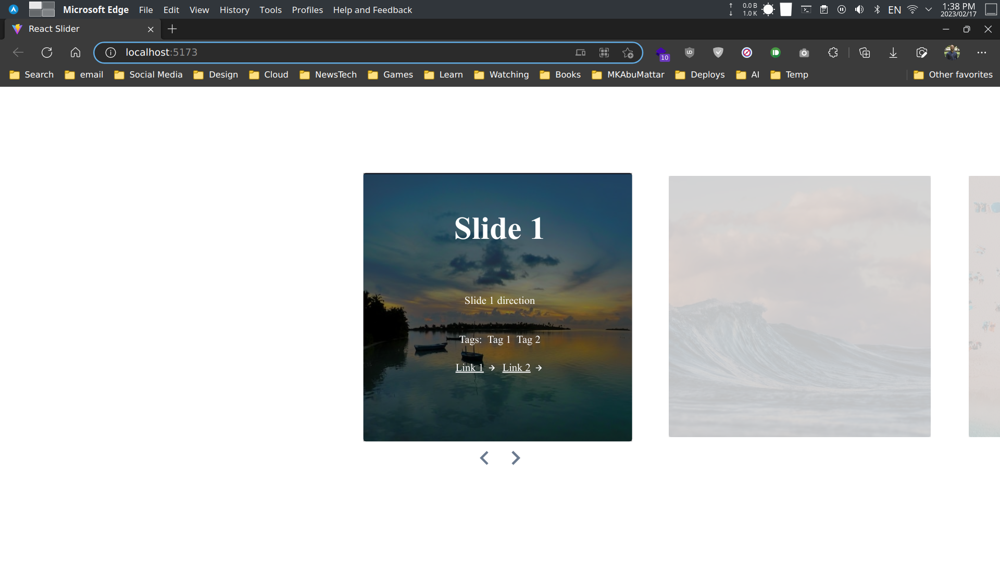

# React Hooks Slider

A simple slider component built with React Hooks.

## Usage

```bash
# clone the repo
git clone https://github.com/MKAbuMattar/react-hooks-slider.git

# install dependencies
cd react-hooks-slider
npm install

# run the app
npm run dev
```

## Demo

[**Demo**](https://react-hooks-slider.vercel.app/)

## Screenshot



## License

[MIT](./LICENSE)

## Author

[**Mohammad Abu Mattar**](https://mkabumattar.github.io)

## Acknowledgments

- [React Hooks](https://reactjs.org/docs/hooks-intro.html)
- [React Hooks Tutorial](https://www.youtube.com/watch?v=dpw9EHDh2bM)
